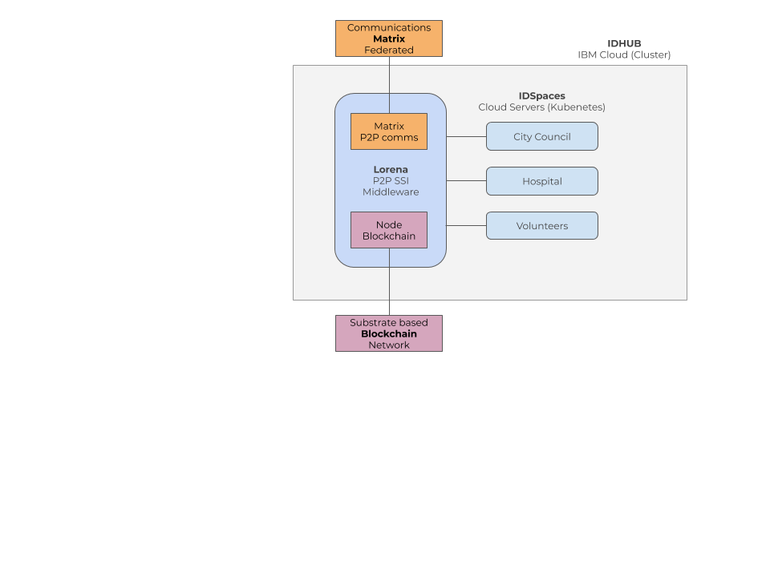

# IDHub
Local Ecosystem

One IDHub is a cluster in the Cloud containing the basic services of Lorena:
Matrix server (federated) : P2P communications between the members of the IDHUB and with members of other IDHUBs (interoperable)
Blockchain node : Local node of the Blockchain where DIDs and Public keys are stored and verified.
IDSpaces. The different IDSpaces of organizations and citizens in that IDHUB : City council, Local Organizations, Health institutions, shops…

