# Managing Lorena Terminal

In this tutorial we will show how to manage your wallet. It's assumed that Lorena Terminal has been previously installed. When using Lorena Terminal you can have several wallets, and access them simultaneously from different terminals. This might be useful because every wallet is associated to only one `network`. Each wallet though, can be connected to several IdSpaces in the same `network` using `link`s. In this tutorial there we will be using one Lorena IdSpace that will be manipulated from a Lorena Wallet. This means that a Lorena IdSpace must be running on a console with access to its logs.

You can install Lorena Terminal  with the following commands:

```bash
npm install @lorena-ssi/lorena-terminal -g
```

or

```bash
git clone https://github.com/lorena-ssi/terminal.git
cd terminal
./terminal
```

## Create your wallet giving the first `link`

After running Lorena Terminal we will be asked if we want to log in or add a wallet. Since is the first time, and we don't have a wallet, we will `Add Wallet`. A username and passwords are needed for the wallet. In this example, the wallet created will have as a username `firstWallet`.

After, Terminal will ask information about your first `link`. Lorena Terminal needs a first `link` in order to start. `links` are the way Lorena Terminal communicates with the different IdSpaces in the network. So that value that we need to type is your Lorena IdSpace's DID, it will be something similar to `did:lor:labdev:Y2pob2IyZFJWa2hYZFU0NWVWOXhTa2t5`. In this case we can see that this DID is in the network `labdev`. This is important because all future `link`s done with this wallet must be in the `network` of the first connection.

As you can see `link`s are quite long and non human readable, this is why the concept of `alias`  exists. Every time we want to make reference to a specific `link`, it will be done through `alias`es. This is why the following value Lorena Terminal needs is an `alias` to make reference to the `link` created. As an example, we will call our first `link` as `firstLink`.

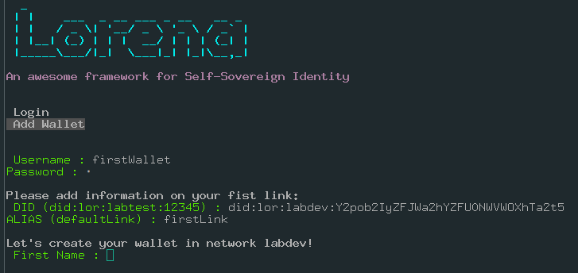

Now, the first `link` is done so we will continue creating our wallet. To do so, Fill with your personal information all the prompt information, and confirm the changes inserting your password.

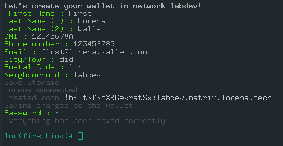

Congratulations! You have created your first Lorena Wallet and the first `link`. Notice that the name of your first `link` appears between parenthesis `lor(firstLink)#` in this example). This is due to the fact that Lorena is designed to interact with IdSpaces or other Lorena nodes. So the workflow will always start by activating the `link` you want to operate with, execute the commands, close the link, and save the changes if needed. Through this tutorial we will be always using the `link` with `alias` `firstLink`.


## link-member-of and link-member-of-confirm for admin and individual

### Claiming Admin role

Now we are going ask to be member of our Lorena IdSpace.

First step is to activate the link of your IdSpace, in our case is `firstLink`, using command `link`. Once you have your link activated we will use command `link-member-of` to ask our IdSpace to have a role of `admin`.

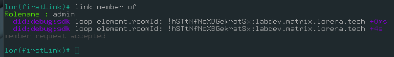

Now we have to send the admin secret code to our IdSpace. This code is shown when running the IdSpace for the first time and it might look something like this:

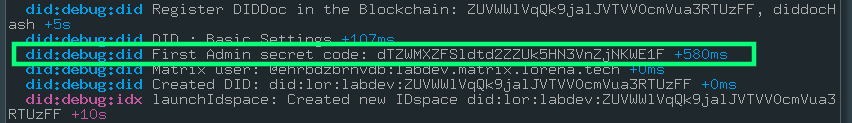

Once we know this code we can use command `link-member-of-confirm` and insert the secret code when is asked for. If everything goes as expected a confirmation message should be shown.

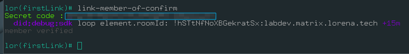

Now you can use command `link-member-list` to see all the information about all your memberships. For now, we will only have one connection with our IdSpace with `roleName` `admin`. Note that this will show the memberships of the connection you are linked to.

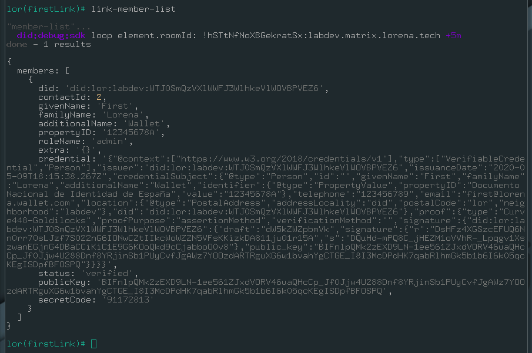

### Claiming other roles

In order to claim other roles the process is similar but asking for another `roleName` that the IDspace supports and handing a secret code that will be given by the IDspace when petition is received. In this example we are going to use the `roleName` `volunteer`.

1. The first step is to run the `link-member-of` command, and write `volunteer` as the `roleName`.

2. Get secret code from IdSpace. Should look something like this (IdSpace terminal):
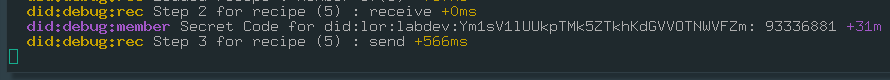

3. Use command `link-member-of-confirm` and the secret code to confirm the role to your Wallet.

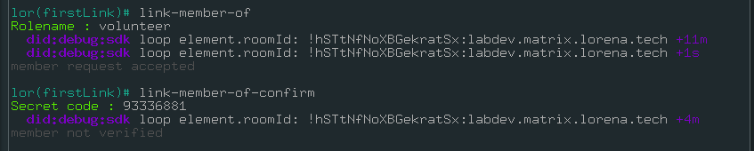

Now we can confirm we have two connections created using the command `link-member-list`. The first connection corresponds to our admin membership and the other is the membership we just made with `volunteer` as a `roleName`. This second connection has a status of `requested` instead of `accepted` link the `admin` membership. This is because the admin role is automatically accepted and other roles must be accepted by the `admin`.

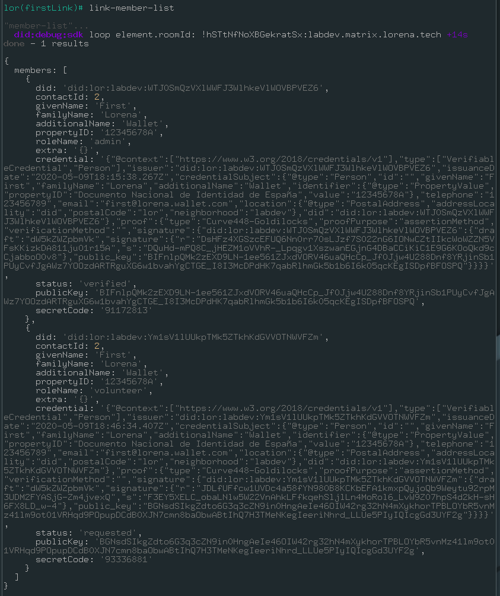

Since we have an `admin` role for our IdSpace we can accept ourselves as a `volunteer` member.

The IDspace log will show the secret code needed to confirm the admin request, also if you are already an admin, you can call `link-member-list` to see the requests and its associated codes. Call now `link-member-of-confirm` with that secret code.

## Export/import your wallet

When logged in your terminal, you can use `export` command to create a json file in the desired path. After exporting it (the default path is the current path where terminal is executed), you can use it when start a new session with terminal:

```shell
./terminal username_wallet.json
```
(Remember to change the path with the correct path of your exported wallet json file)

## Create credential **as admin** from terminal link-credential-add

As admin you can create credentials that will be later be issued to different roles.
To do so, enter in Lorena Terminal `link-credential-add`.

You will be prompted with X questions:

· `title`: 
· `myDescription`: 
· `url`: 
· `requirements`:

If everything works correctly a json similar to this will be prompt:

```json
{
  success: true,
  id: 2,
  did: 'did:lor:labdev:bafyreigbgef6rh7z4en4qx32ef2mirvyshskud5pbhmwlox67tenhkdndu'
}
```
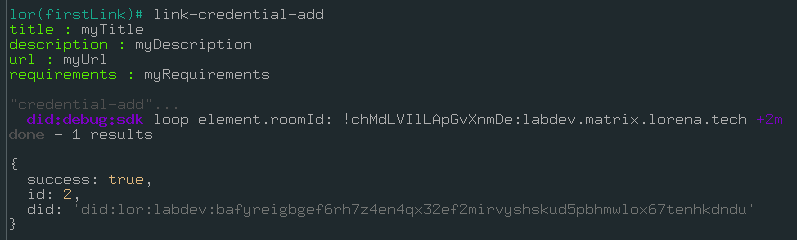

## Issue credential as **as admin** for individual in terminal link-credential-issue

Now that the credential is added to the admin wallet, we can issue a credential using command `link-credential-issue`.
To do so, we need the `id` property of the json prompted in the previous step (in this example cause `id: 2`).


## See credential issued in terminal link-credential-issued

In order to check the state of an issued credential, you can use the command `link-credential-issued`. To do so, the credential `id` will be needed

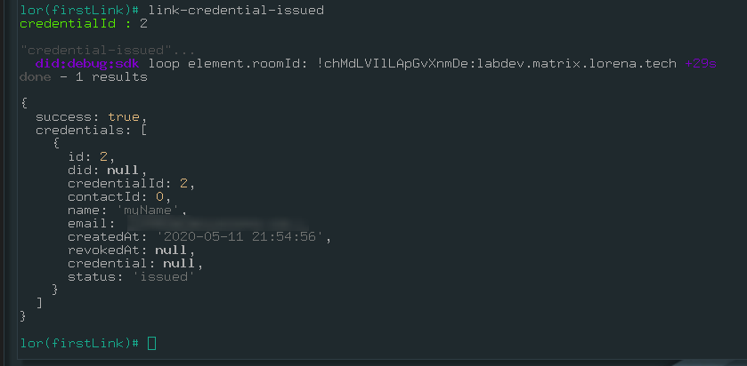

## List of credentials `link-credential-list`

You can check all your credentials added with command `link-credential-list`. The output should look something like this.

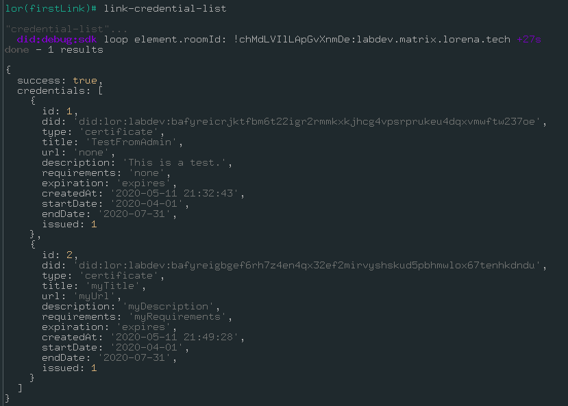

## Get credential `link-credential-get`

You might want to select a particular credential from who you know the id, let's say `2` (following the example above). Then we can make usage of `link-credential-get` command, where you will be asked to insert your `credentalId`.

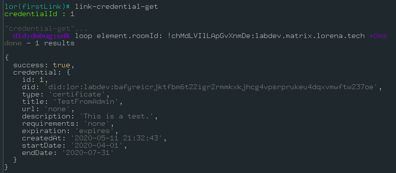

## Verify your credential with `link-credential-verify` command

To verify your credentials you can use `link-credential-verify`. Remember that th eexpected json is obtained from `link-credential-get` passing the correct `id`.

## Verify credential in https://verify.lorena.tech

You can also check or verify your verifiable credential copying the json prompted by `link-credential-verify` command, and pasting in the following url [https://verify.lorena.tech](https://verify.lorena.tech).