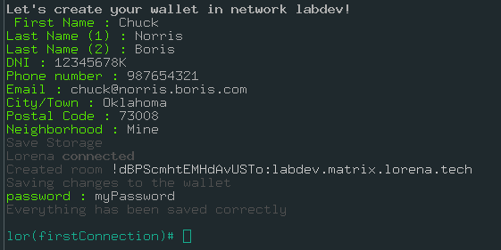
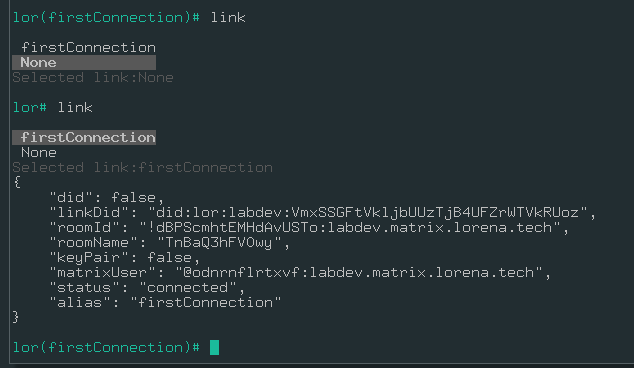
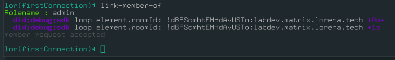
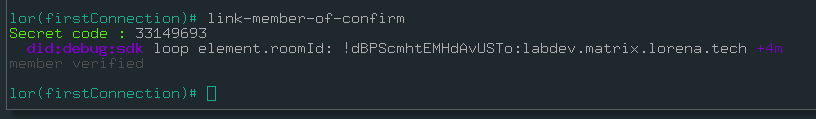

# Your first `link` using Lorena Terminal

You can start playing a bit, lets check all commands you can try.

Let's add your first link. We will connect with the IDspace we just created for you.

## Create your wallet giving the first `link`

In order to start lorena's terminal run the following command:

```bash
git clone https://github.com/lorena-ssi/terminal.git
cd terminal
./terminal
```

### Create a link

Once the terminal is running it will prompt 

```
Wallet does not exist. Create a new wallet? y/n 
```

Lorena terminal will prompt this everytime the username and password are not in the database. This means that a new user es going to be created or a wrong user/password was given. Hit `y` in order to create a new wallet.

The following step is to give the `DID` of the idpspace you want to connect to. In order to make it easier for the user we will add an alias to this connection. The process up to here, would look something like this:


We have given all the information of our first connection. Now let's create your wallet. This step is mandatory and will be automatically prompt by terminal.

Once you add your personal info, insert your password when asked to save all changes in your terminal. The process should look something like this:



As you can see, now that the process has ended, that the name of your first connection appears in the terminal (`lor (yourConnection) #`). When the user has several connections, this can be useful to know in which one the changes are being done. Most of the commands that we will present you will be relative to the link the user is active.

### Basic Commands
#### `help`

 ```bash
 lor(firstConnection)# help
┌────────┬───────────────────────┐
│ (index)  │          Values           │
├────────┼───────────────────────┤
│    0    │          'help'            │
│    1    │          'info'            │
│    2    │          'link'            │
│    3    │      'link-pubkey'         │
│    4    │         'links'            │
│    5    │        'link-add'          │
│    6    │       'link-ping'          │
│    7    │    'link-ping-admin'       │
│    8    │     'link-member-of'       │
│    9    │ 'link-member-of-confirm'   │
│   10    │    'link-member-list'      │
│   11    │   'link-action-issue'      │
│   12    │   'link-action-update'     │
│   13    │  'link-credential-add'     │
│   14    │  'link-credential-get'     │
│   15    │ 'link-credential-issue'    │
│   16    │ 'link-credential-issued'   │
│   17    │  'link-credential-list'    │
│   18    │       'credential'         │
│   19    │      'credentials'         │
│   20    │      'action-issue'        │
│   21    │          'save'            │
│   22    │          'exit'            │
└────────┴───────────────────────┘
 ```

#### `info`

```bash
lor(firstConnection)# info
{
    "matrixUser": "mzrkbxdqedvz",
    "matrixPass": "ell1QkhPRzVI",
    "keyPair": {},
    "person": {
        "@type": "Person",
        "id": "",
        "givenName": "Chuck",
        "familyName": "Norris",
        "additionalName": "Boris",
        "identifier": {
            "@type": "PropertyValue",
            "propertyID": "Documento Nacional de Identidad de España",
            "value": "12345678K"
        },
        "telephone": "987654321",
        "email": "chuck@norris.boris.com",
        "location": {
            "@type": "PostalAddress",
            "addressLocality": "Oklahoma",
            "postalCode": "73008",
            "neighborhood": "Mine"
        }
    },
    "type": "substrate",
    "blockchainServer": "wss://labdev.substrate.lorena.tech",
    "matrixServer": "https://labdev.matrix.lorena.tech"
}
```

#### `link`

Selects active `link`/conenction. A menu will be prompt with all your connections for you to choose which want you want to be active. A value of `None`  can be also given.



#### `link-pubkey`

TODO

#### `links`

```bash
lor(firstConnection)# links
[
    {
        "did": false,
        "linkDid": "did:lor:labdev:VmxSSGFtVkljbUUzTjB4UFZrWTVkRUoz",
        "roomId": "!dBPScmhtEMHdAvUSTo:labdev.matrix.lorena.tech",
        "roomName": "TnBaQ3hFV0wy",
        "keyPair": false,
        "matrixUser": "@odnrnflrtxvf:labdev.matrix.lorena.tech",
        "status": "connected",
        "alias": "firstConnection"
    }
]


```

#### `link-add`

TODO

#### `link-ping`

TODO

#### `link-ping-admin`

TODO

#### `link-member-of`



#### `link-member-of-confirm`

TODO

#### `link-member-list`

TODO

#### `link-action-issue`

TODO

#### `link-action-update`

TODO

#### `link-credential-add`

TODO

#### `link-credential-get`

TODO

#### `link-credential-issue`

TODO

#### `link-credential-issued`

TODO

#### `link-credential-list`

TODO

#### `credential`

TODO

#### `credentials`

TODO

#### `action-issue`

TODO

#### `save`

TODO

#### `exit`

TODO

#### `ctrl + C`

TODO


## Claiming Admin role

In the IDspace a challenge will be done to the DID of the IDspace to verify other's side keys. key signature verification is done in both sides.

There are two ways to claim a role of admin in an organization:

### IDspace init secret code

If you use the `secretCode` generated when the IDspace is created (`./IDspace init`). This is useful only once: that code won't be usable again.




### New admin request

If you want to add an additional identity as admin of an IDspace you can use `link-member-of` and `link-member-of-confirm`.


The IDspace log will show the secret code needed to confirm the admin request, also if you are already an admin, you can call `link-member-list` to see the requests and its associated codes. Call now `link-member-of-confirm` with that secret code.


## Viewing roles

```bash
lorena(firstConnection)# link-member-list
```

You can see your identity listed with the `admin` role.

## Approving additional members and roles

Other roles can be added to the organization with the same process as the New Admin Request, except instead of looking at the IDspace log, the admin looks at the `link-member-list` for the secret code, which the admin then transmits to the prospective member out-of-band.

* New member
  * creates a new session with `./terminal`, with a new username and password
  * creates a new room using `link-add`
  * calls `link-member-of` with the role desired (e.g. `developer`)
* Admin
  * calls `link-member-list` to see information for the new member with status `requested`
  * gives the `secretCode` to the new member through a secondary medium (messenger, email, phone)
* New member
  * calls `link-member-of-confirm` with the `secretCode` given by the admin

The new member will now have the status `verified`.