# Managing Lorena Terminal

In this tutorial we will show how to manage your wallet. We are going to show you how to install and use Lorena Terminal and his feautures. When using Lorena Terminal you can have several wallets, and access them simultaneously from different terminals, web applications or new wallets. This might be useful because every wallet is associated to only one `network`, there can be many other `networks` live. Each wallet though, can be connected to several IDSpaces in the same `network` using `link`s. 

In this tutorial there we will be using one Lorena IDSpace that will be manipulated from Lorena Wallets. This means Lorena Terminal will create a Wallet with your data, and it will be connected to Lorena IDSpace from our main subtrate `network`.

First of all, you have to install Lorena Terminal with the following commands:


```bash
git clone https://github.com/lorena-ssi/terminal.git
cd terminal
npm i
./terminal
```

## Create your own Lorena Wallet

After running Lorena Terminal we will be asked if we want to log in or add a wallet. Since is the first time, and we don't have a wallet, we will `Add Wallet`. 

A username and password are needed for the wallet. In our case, the wallet was created with the username `diego7`.

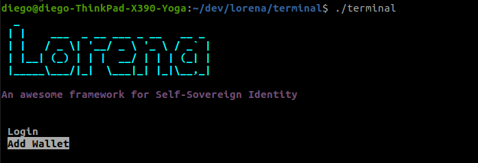


Terminal will ask information about your first `link`. Lorena Terminal needs a first `link` in order to start. `links` are the way Lorena Terminal communicates with the different IDSpaces in the network. So that value that we need to type is your Lorena IdSpace's DID: `did:lor:labtest:VmtsNVVUaHRiVkJDTXpsdFdHVllXbkF0`. 
In this case we can see that this DID is in the network `labtest`. This is important because all future `link`s done with this wallet must be in the `network` of the first connection. Additionally, add an alias for that network in order to make your life easier! did is not a the best friendly name to remember...

As you can see `link`s are quite long and non human readable, this is why the concept of `alias`  exists. Every time we want to make reference to a specific `link`, it will be done through `alias`es. This is why the following value Lorena Terminal needs is an `alias` to make reference to the `link` created. As an example, we will call our first `link` as `labtest`.


Now, the first `link` is done so we will continue creating our wallet. To do so, Fill with your personal information all the prompt information, and confirm the changes inserting your password.

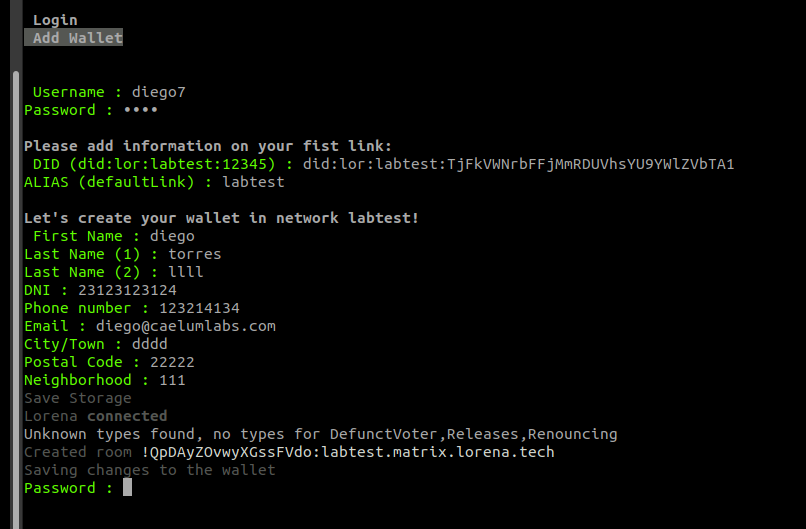

Congratulations! You have created your first Lorena Wallet and the first `link`. Notice that the name of your first `link` appears between parenthesis `lor(labtest)#` in this example). This is due to the fact that Lorena is designed to interact with IdSpaces or other Lorena nodes. So the workflow will always start by activating the `link` you want to operate with, execute the commands, close the link, and save the changes if needed. Through this tutorial we will be always using the `link` with `alias` `firstLink`.


## Let's play as Admin!

Keep your first wallet window or tab "terminal" opened. Now we are going to manage the Lorena IdSpace with the admin role.

Download the admin wallet and put it into the terminal folder:

[adminlorena_wallet.json](../images/adminlorena_wallet.json)

Now, open a second terminal for the admin role:

```bash
./terminal adminlorena_wallet.json
```
You'll be asked for the password, don't worry, it is `admin123`, and don't panic with it, the playground for the tutorial is well protected!

Let's call our first terminal cli "User Terminal" and the admin one "Admin Terminal", now we are going to play ping-pong with them ;)

From User Terminal, we want to confirm the link we have with the IDSpace. Admin has to approve it. Then, let's check our link:


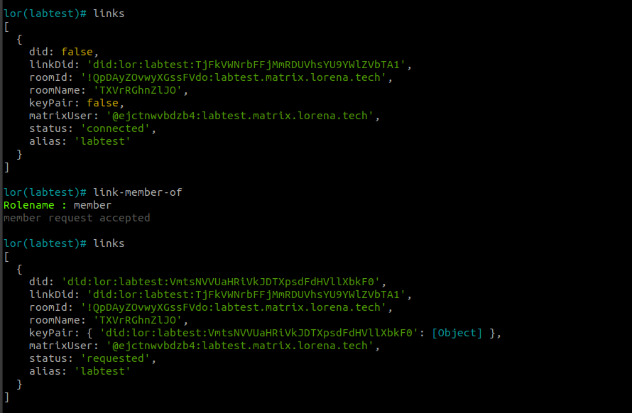

We can see the first status as "connected". After requesting being a "member", we can see the link status as "requested". 
There are three states: 
- `connected`: just connected to the IDSpace but it hasn't assign us any role.
- `requested`: as user we can ask the IDSpace admin if they accept as any rolename. Now we have two kind of roles `member` or `admin`.
- `verified`: user has the role accepted by the IDSpace.

When user ask for being member with the command `link-member-of`, admin can check the request. Go to Admin Terminal check it:
```bash
lor(labtest)# link-member-list
```
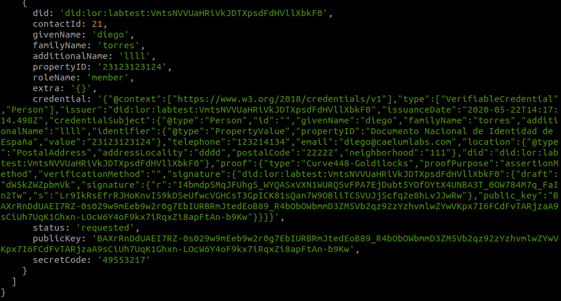


You can see the requester, diego with rolename member has the status `requested` for that role. At the end, there is the a code called `secretcode`. This is the code User needs to be a member of that IDSpace. In other environment, admin's will send that code to the user, but now we are learning how to accept other members being members of the IDSpace.

From the User Terminal, let's go to introduce code and check the status as `verified`:

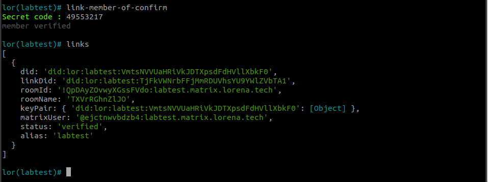

Notice the user is who introduce the code and then, IDSpace accept it. 

From the admin side, Admin Terminal, we can check the `verified` status too with the command `link-member-list`:

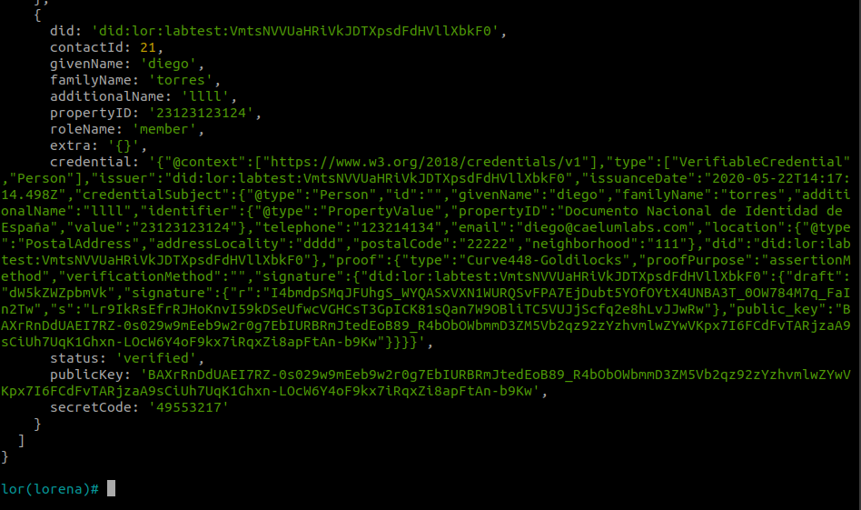

## Who said credential is hard?

Nowadays, credentials are important to verify actions, documents, processes,...with Lorena you have it as easy as this:

From Admin Terminal, let's create a new type of credential with the command `link-crendential-add`:

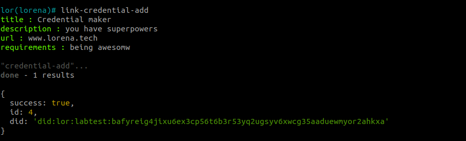

Great! We can customize it as we wish. Now, let's issue one [Verifiable Credential](../2_overview/credentials.md) to our user 'diego'. We have to put the credentialID just created (image above) and, in the `email` field, put your email to receive your fist credential :D

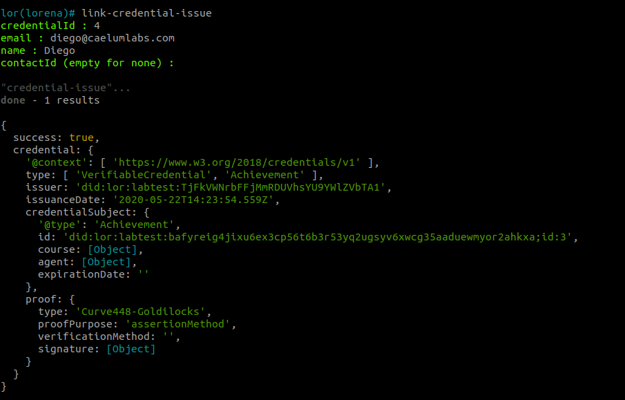

Did you believe that? Check your email, get your credential and verify it in our platform copying the json content and pasting in the following url [https://verify.test.lorena.tech](https://verify.test.lorena.tech).

Alright! Now you can start issuing Veriable Credentials and verify them as many as you want :D


## Updating user roles

As user, if we are admin we could `ping` to the IDSpace and, if we were, IDSpace will answee with a `pong`. But now, as user we don't receive answer. From User Terminal, try `link-ping-admin`:

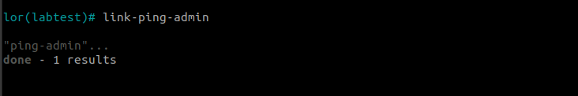

Let turn user an admin. From Admin Terminal, you can change roles with the command `link-member-update`:

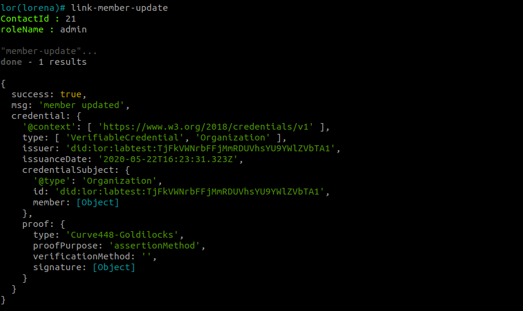

You have to put the contactID got it from `link-member-list`, and the new rolename `admin`. 

Now, user is admin too! Let's try our superpower pinging the IDSpace:

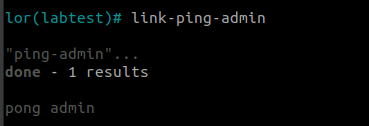

From the Admin Terminal, I can check it too with the command `link-member-list`:

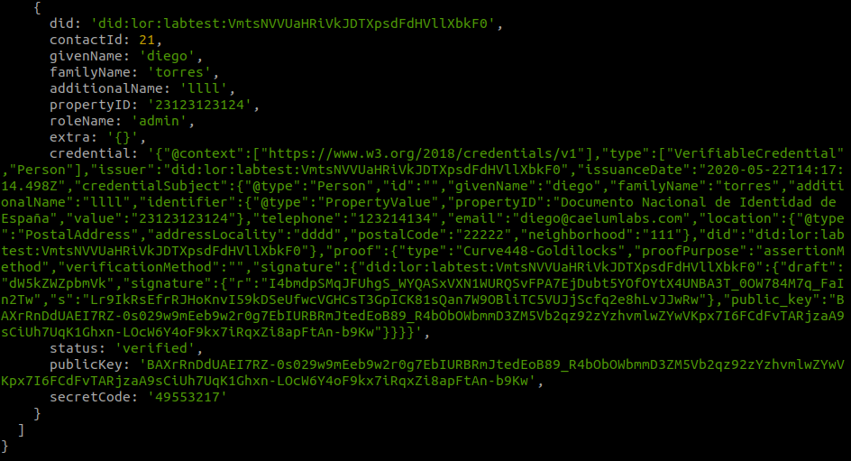

Amazing! Now can manage our users as we wish!
