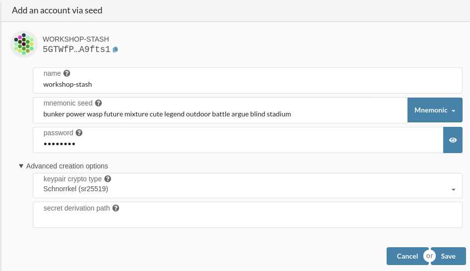
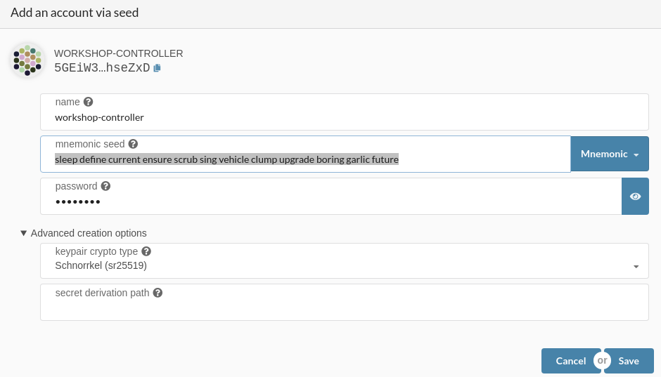
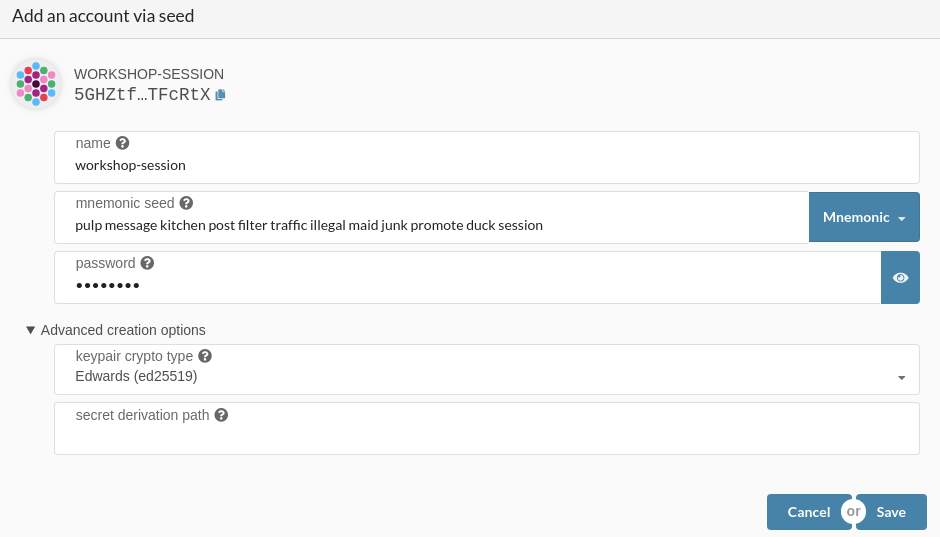
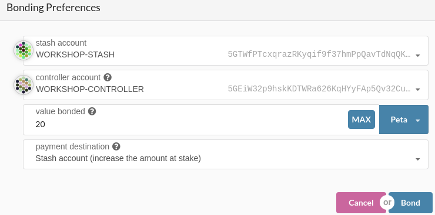
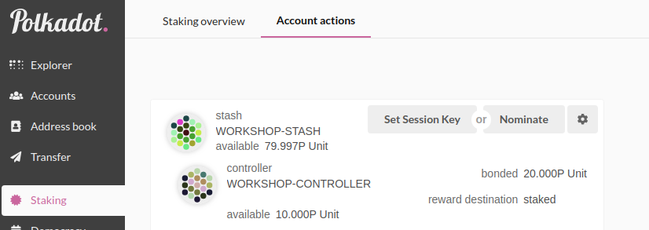
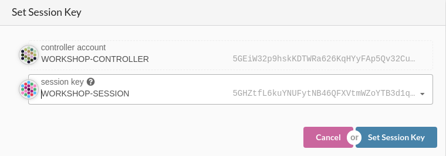

- [Description](#description)
- [Installation](#installation)
  - [Install docker](#install-docker)
- [Deploy](#deploy)
  - [Create substrate keys](#create-substrate-keys)
- [Run your validator node](#run-your-validator-node)
  - [Bond DEV tokens](#bond-dev-tokens)
  - [Set Session Keys](#set-session-keys)
  - [Restart your node](#restart-your-node)
- [Monitoring Tools](#monitoring-tools)

# Description

Workshop to deploy substrate nodes in Lorena blockchain network

# Installation

## Install docker

[Documentation]: https://docs.docker.com/install
[Post Installation]: https://docs.docker.com/install/linux/linux-postinstall/

```bash
sudo apt-get update
sudo apt install docker.io
sudo systemctl start docker
docker --version
```

If you don’t want to preface the docker command with sudo, create a Unix group called docker and add users to it. When the Docker daemon starts, it creates a Unix socket accessible by members of the docker group.

```bash
sudo groupadd docker
sudo usermod -aG docker

# logout & login
```

* Download CaelumLabs Substrate Docker image

```bash
docker pull eu.gcr.io/caelumlabs-hub01/substrate-apps/lorena-radices:workshop_latest
```

# Deploy

## Create substrate keys

[Documentation]: https://wiki.polkadot.network/docs/en/learn-keys

To create a validator node we will create 3 keys:

* **Stash Account (sr25519)**: The validator wallet with the funds bonded for staking.
* **Controller Account (sr25519)**: Account to start/stop validating and nominate.
* **Session Account (ed25519)**: hot keys that be must kept online by a validator to perform network operations.

We can create it following these steps:

  - Open [PolkadotJS]: https://polkadotjs.caelumlabs.com/#/settings

  - Enable Custom endpoint and add our substrate workshop network as "Remote Node/Endpoint"

  ```
  wss://substrate-workshop.caelumlabs.com/
  ```

  - Create Stash Account (**Save your Mnemonic Seed**)
  - 

  - Create Controller Account (**Save your Mnemonic Seed**)
  - 

  - Create Session Account (**Save your Mnemonic Seed**)
  - 

  - Request your DEV tokens 100Pdevs for stash account and 10Pdevs for controller account.

  - Install `subkey`

  ```
  curl https://getsubstrate.io -sSf | bash -s -- --fast
  cargo install --force --git https://github.com/paritytech/substrate subkey
  ```

  - Use your Session Key Mnemonic Seed to get a new node key seed and **save it**.

  ```
  subkey --ed25519 inspect "All of words of my seed"
  ```

# Run your validator node

Get the previous **node key seed without "0x" address prefix and put it on --node-key parameter** in the next command.

Also we will **change the value of the second --name** parameter,above the `bootnodes` parameter

```
docker run --rm -it -p 30333:30333/tcp -p 30333:30333/udp -p 9944:9944/tcp \
  --name workshop-node1 eu.gcr.io/caelumlabs-hub01/substrate-apps/lorena-radices:workshop_latest \
  --chain staging  \
  --base-path /tmp/workshop \
  --name workshop-validator-${MyName} \
  --bootnodes /ip4/34.76.112.106/tcp/30333/p2p/QmZtoYC1dwdY2bDjJYXeE9EWSsyZP5rvpj4TkdyYojH48o \
  --node-key bc7XXXXXXXXXXXXXXXXXXXXXXXXXXXXXXXXXXXXXXXXXXXXXXXX
```

## Bond DEV tokens

It is now time to set up our validator from Polkadot JS. We will do the following:

- First, go to the Staking section. Click on "Account Actions", and then the "New stake" button.
- 

## Set Session Keys
- Second, also in the staking section, click on "Account Actions" -> "Set Session Key" above our stake.
- 
- 

## Restart your node

Once your node is fully synced, stop the process by pressing Ctrl-C. At your terminal prompt, you will now start running the node in validator mode with the pruning option set to archive.

```
docker run --rm -it -p 30333:30333/tcp -p 30333:30333/udp -p 9944:9944/tcp \
  --name workshop-node1 eu.gcr.io/caelumlabs-hub01/substrate-apps/lorena-radices:workshop_latest \
  --chain staging  \
  --base-path /tmp/workshop \
  --name workshop-validator-${MyName} \
  --bootnodes /ip4/34.76.112.106/tcp/30333/p2p/QmZtoYC1dwdY2bDjJYXeE9EWSsyZP5rvpj4TkdyYojH48o \
  --node-key bc7XXXXXXXXXXXXXXXXXXXXXXXXXXXXXXXXXXXXXXXXXXXXXXXX
  --validator
```

# Monitoring Tools

- Polkadot JS - Blockchain Explorer : https://polkadotjs.caelumlabs.com/
- Telemetry - Nodes Explorer: https://telemetry.polkadot.io/#list/Staging%20Testnet
