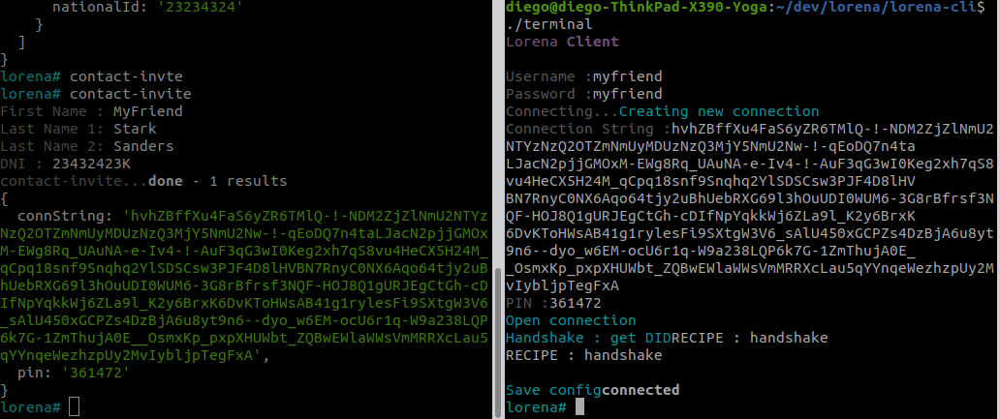

# Your first contact using Lorena CLI

! Remember you should finished [installation](installation.md) to continue with tutorial, you need a _connection string_ and _PIN code_ to continue:


Now, with your CLI running like this:

You can start playing a bit, lets check all commands you can try. Remember, all that commands are recipes and you can create yours in this [installation](create-recipes.md).

Now, you can check what is your contact list:

```bash
lorena# contact-list
contact-list...done - 1 results
{
  invited: [],
  verified: [
    {
      id: 2,
      did: 'ZDE5RlNHNUtVMDFIWlVKek1tTk1hMUV3',
      didMethod: 'labtest',
      createdAt: '2020-04-06 08:29:46',
      joinAt: '2020-04-06 08:32:10',
      status: 'verified',
      type: 'contact',
      name: 'diego',
      alias: 'diego',
      fullName: 'diego dddd sddsds',
      nationalId: '23234324'
    }
  ]
}
```
In your contact-list appears yourself.

To invite someone else, execute the command _contact-invite_ and you will get the connectrion-string and the PIN code:


```bash
lorena# contact-invite
First Name : MyFriend
Last Name 1: Stark
Last Name 2: Sanders
DNI : 23432423K
contact-invite...done - 1 results
{
  connString: 'hvhZBffXu4FaS6yZR6TMlQ-!-NDM2ZjZlNmU2NTYzNzQ2OTZmNmUyMDUzNzQ3MjY5NmU2Nw-!-qEoDQ7n4taLJacN2pjjGMOxM-EWg8Rq_UAuNA-e-Iv4-!-AuF3qG3wI0Keg2xh7qS8vu4HeCX5H24M_qCpq18snf9Snqhq2YlSDSCsw3PJF4D8lHVBN7RnyC0NX6Aqo64tjy2uBhUebRXG69l3hOuUDI0WUM6-3G8rBfrsf3NQF-HOJ8Q1gURJEgCtGh-cDIfNpYqkkWj6ZLa9l_K2y6BrxK6DvKToHWsAB41g1rylesFi9SXtgW3V6_sAlU450xGCPZs4DzBjA6u8yt9n6--dyo_w6EM-ocU6r1q-W9a238LQP6k7G-1ZmThujA0E__OsmxKp_pxpXHUWbt_ZQBwEWlaWWsVmMRRXcLau5qYYnqeWezhzpUy2MvIybljpTegFxA',
  pin: '361472'
}

```

Then, with another bash terminal, you can access to your _MyFriend_:



Left side is my first Lorena ID (diego), and the right one is accessing my second I've just invited (MyFriend).

Now, if you want to see who is your contact, you can check _myfriend_ is:

```bash
lorena# contact-list
contact-list...done - 1 results
{
  invited: [],
  verified: [
    {
      id: 2,
      did: 'ZDE5RlNHNUtVMDFIWlVKek1tTk1hMUV3',
      didMethod: 'labtest',
      createdAt: '2020-04-06 08:29:46',
      joinAt: '2020-04-06 08:32:10',
      status: 'verified',
      type: 'contact',
      name: 'diego',
      alias: 'diego',
      fullName: 'diego dddd sddsds',
      nationalId: '23234324'
    },
    {
      id: 3,
      did: 'ZVVWMFIyZDJPRFUzY0ZkMFNtRldPV05p',
      didMethod: 'labtest',
      createdAt: '2020-04-06 08:45:46',
      joinAt: '2020-04-06 08:49:45',
      status: 'verified',
      type: 'contact',
      name: 'myfriend',
      alias: 'myfriend',
      fullName: 'MyFriend Stark Sanders',
      nationalId: '23432423K'
    }
  ]
}
```

In addition, you can check de public key of your contact and validate you are connected:

```bash
lorena# contact-info
DID : ZVVWMFIyZDJPRFUzY0ZkMFNtRldPV05p
contact-info...done - 1 results
{
  did: 'ZVVWMFIyZDJPRFUzY0ZkMFNtRldPV05p',
  pubKey: 'BHRygkvfZKNbh5-t-vu8y1ioxaK1viWzszGWeULjuwc5xwZh28wLlOVc0-VH1Y15X5D5av2w-vkBOoBTm3f9MhVzT7EG06ICrcBeGhyhRRt76gUnUN-Xc1E5leUpAXxshF9d6LvGrhIT628nRYSsFO0',
  connected: true
}
```

